# school-telegram-bot
Chat Bot using Telegram API on Laravel backend, to help students in secondary activate their admission numbers before registration on the CBT website; also view info about the school.

## The Problem
Multiple registration on the school CBT website led to building this chat bot on telegram. To avoid the database being clogged with redudant user accounts, the option to activate admission number was added. This was actually for convenience sake, since students can activate their numbers in school with their teacher.

## The Set-up
The hardest part of building this solution was adopting a pattern for the commands. I arrived at a definite pattern by creating a branching flow of commands. For example, all sub actions on user account is preceeded by the prefix "user-". Subsequently, a hyphen was used to seperate adjoining child commands. Since the API is stateless, communication relied heavily on the uniqueness of each predefined command.

## The Development
### Menu commands
[Accessible through /Help]

/start - Intro

/About - Get to know who we are.

/Help - Tips & links to better navigate this Bot.

/Dm - Direct message us.

/Contacts - Call or send us email.

/Stats - Summary of Bot statistics.

/Search - Find anything by keyword.

/Info - Other important information you need to know.

/Questions - FAQ section for quick answers.

/Reviews - Write us a review.

/Broadcasts - Annoucements you need to know.

/Parents - List of Moms & Dads.

### Bot Features
[Accessible through /Help]

Search Tips
Brief guide on how to search for information on this Bot.

Find an Assessment by ID: Simply enter the Assessment's ID only, in the input field.

Update Own Info: Register admin number with own phone, parent's phone or other phone.

Subscribe Reports: Enter the word 'subscribe' in the text field, to receive assessment reports.

Unsubscribe Reports: Enter the word 'unsubscribe' in the text field, to stop receiving assessment reports.

View Reviews:  Type the word 'Reviews' (cap sensitive), to view all received reviews.

Write us a Review:  Preceed you message with the word 'Reviews' (cap sensitive).

Find an Admin by name / ID: Enter 'search' followed by the Admin's ID, Firstname or Lastname, in the text field.

Find Parent by name / ID: Enter 'search' followed by the Parent's ID, Firstname or Lastname, in the text field.

Send new Direct Message: Enter 'dm' only.

View all sent Direct Messages: Enter 'dm all'.

View your last sent Direct Messages: Enter 'dm last'.

View replied Direct Messages: Enter 'dm replied'.

View unreplied Direct Messages: Enter 'dm unreplied'.

Ask Questions: Just type the words

### Update Panel
[Accessible through /Update]

* Update Admin No with own phone - the device is owned by the student

* Update Admin No with Parent's phone - the device is owned by the parent of the student

* Update Admin with other phone - the phone is neither the student's nor the parent's

* Upload Photo for magazine - only for teachers to send photos

* Request Student's Reports - yet to be enabled

### Admin Actions
auths: Add Authorization codes
users: Add allowed Users by mobile no
display: View saved record
save: To save changes
trash: Delete saved record

### School Info
[Accessible through /About]
Access the Vision, Mission, Core Values, History and School song.

### Activate Admin Number steps
1. Enter correct Admin Number as given in the school
2. Choose your school name
3. Choose your class
4. Registration page is displayed if successfull

## Screanshots
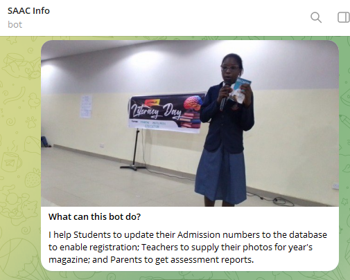

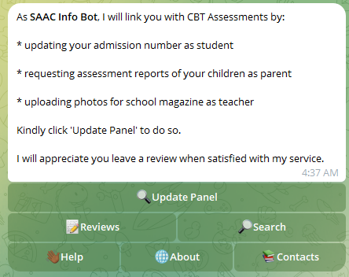

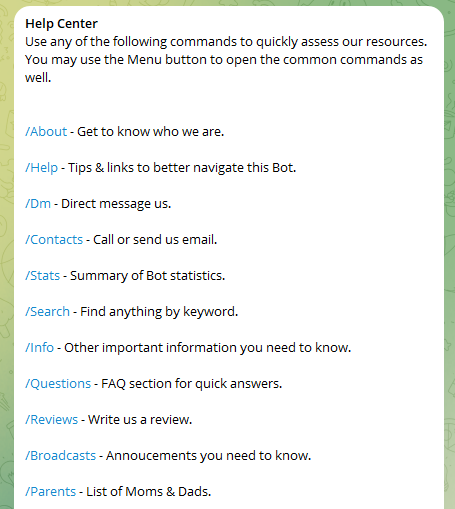

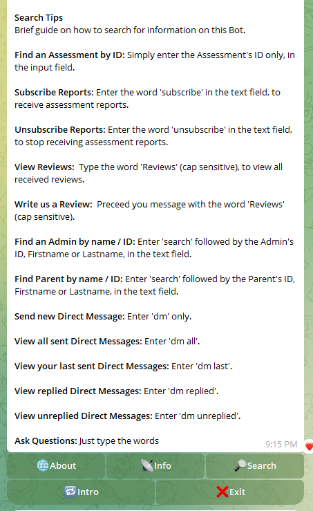

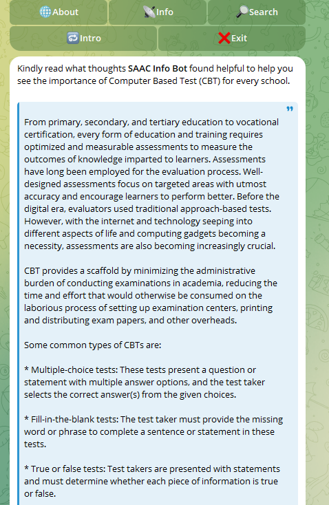

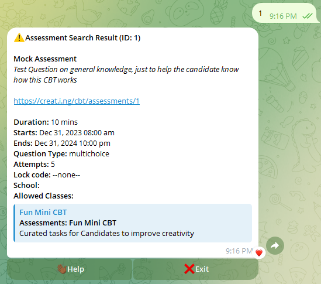

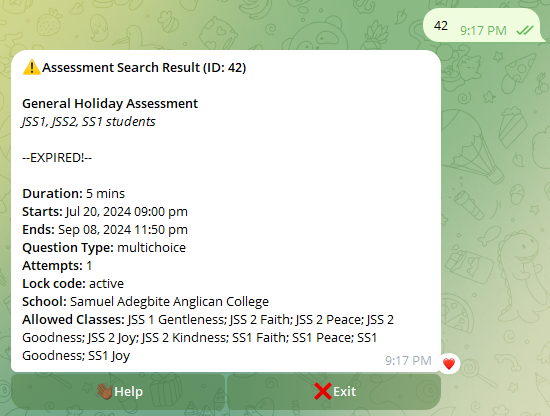

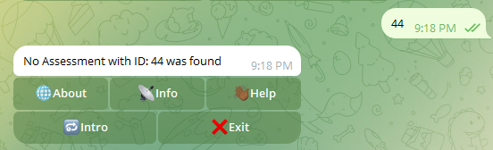

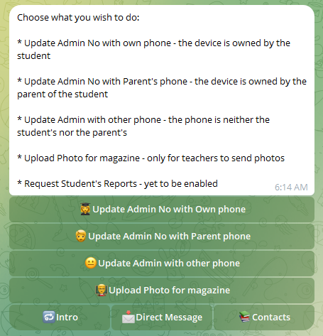

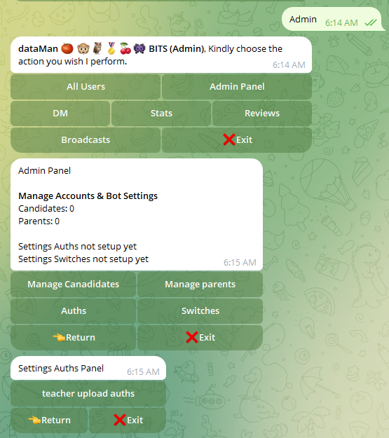

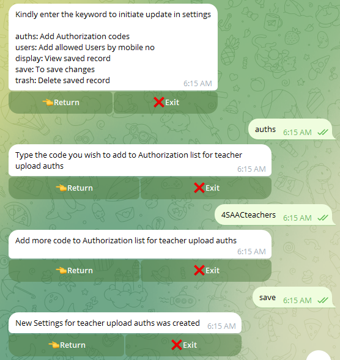

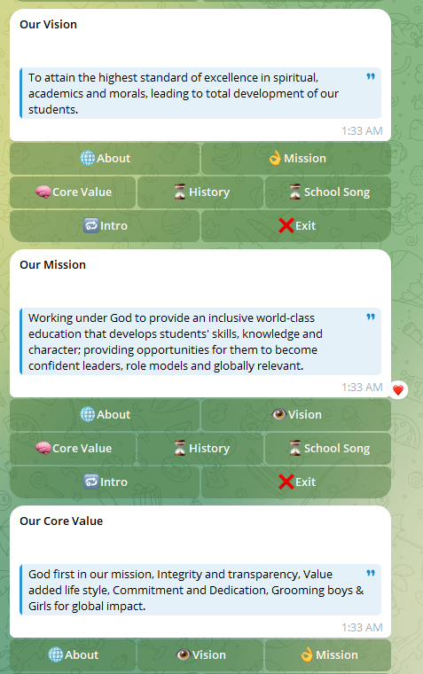

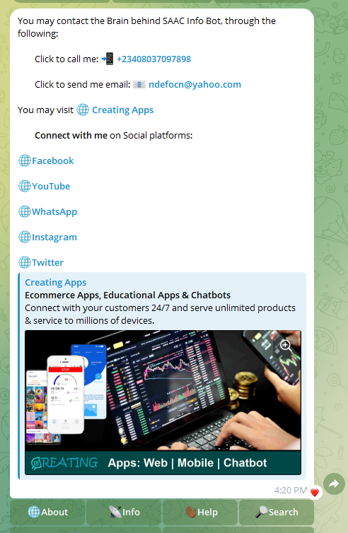

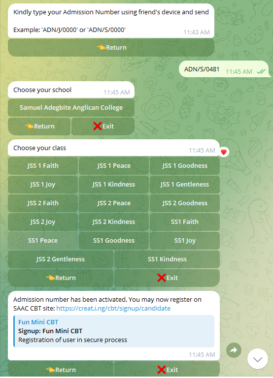

## Summary
Many students found it very convenient to use the app for activation. A certain concern of a parent came up that telegram is considered an uncensored app. This is just an additional way for admin number activation. This bot was created on 12th September, 2024, and was deployed on 11th October, 2024.

You may interact with the bot on 